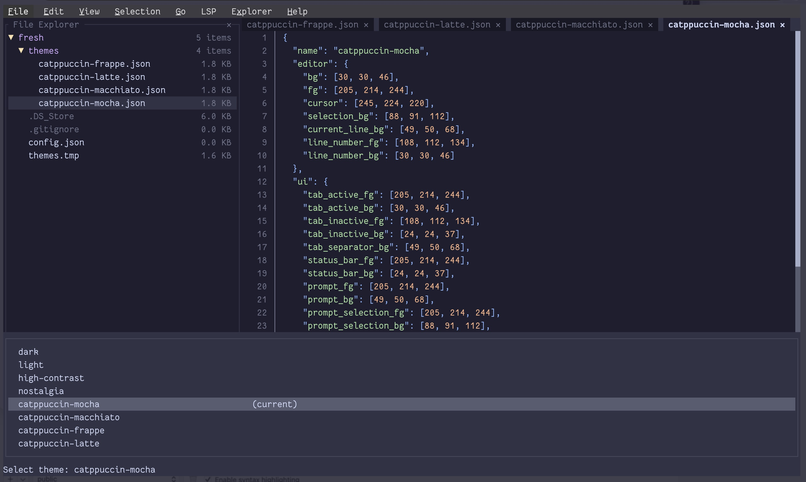
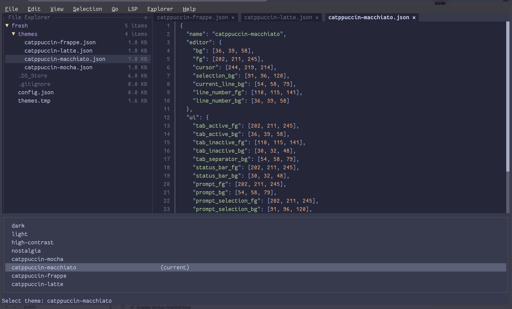
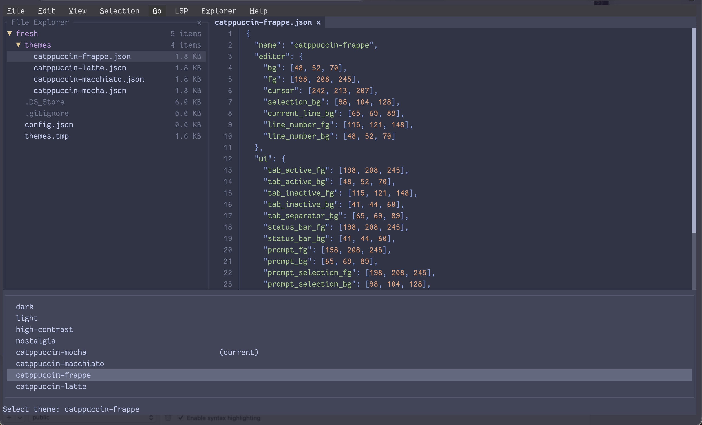
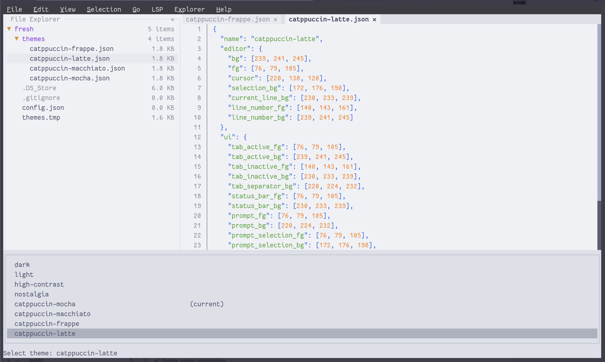

# Catppuccin Theme for Fresh Editor

A collection of Catppuccin color scheme themes for Fresh Editor, featuring all four flavors: Mocha, Macchiato, Frappé, and Latte.

## 🎨 Flavors

- **Mocha** - The darkest flavor with warm undertones
- **Macchiato** - A medium-dark theme with balanced colors
- **Frappé** - A medium-dark theme with cool undertones
- **Latte** - A light theme perfect for daytime coding

## 📸 Screenshots

### Mocha


### Macchiato


### Frappé


### Latte


## 📦 Installation

1. Locate your Fresh Editor themes directory (usually in the editor's configuration folder `.config/fresh/themes/`)
2. Copy the desired theme JSON file(s) to the themes directory
3. Restart Fresh Editor or reload the theme settings
4. Select the theme from the editor's theme picker

## 🎯 Color Palette

Each theme includes:

- **UI Colors**: Background, foreground, cursor, selection, panels, tabs, buttons, inputs, and more
- **Syntax Highlighting**: Comprehensive token colors for:
  - Comments (italicized)
  - Strings
  - Numbers
  - Keywords (bold)
  - Functions
  - Variables
  - Constants
  - Types and Classes
  - Interfaces
  - Properties
  - Tags and Attributes
  - Operators
  - Punctuation
  - Error/Warning/Info/Success indicators
  - Diff highlighting
  - Markdown syntax

## 🔧 Customization

If you need to adjust colors, edit the JSON file and modify the hex color values. The structure is:

```json
{
  "name": "Theme Name",
  "type": "dark" | "light",
  "colors": {
    // UI element colors
  },
  "tokenColors": [
    {
      "name": "Token Name",
      "scope": ["scope.selector"],
      "settings": {
        "foreground": "#hexcolor",
        "fontStyle": "bold" | "italic" | "bold italic"
      }
    }
  ]
}
```

## 🌐 Resources

- [Catppuccin Official Website](https://catppuccin.com)
- [Catppuccin GitHub](https://github.com/catppuccin/catppuccin)
- [Catppuccin Palette](https://github.com/catppuccin/palette)

## 📄 License

These themes use the Catppuccin color palette. Please refer to the Catppuccin project for licensing information.

## Contact

- Twitter: [@to_milon](https://milon.im/twitter)
- Email: contact[@]milon[.]im

---

Enjoy your coding with Catppuccin! ☕️
